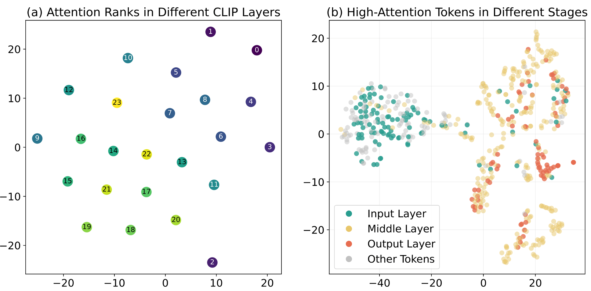
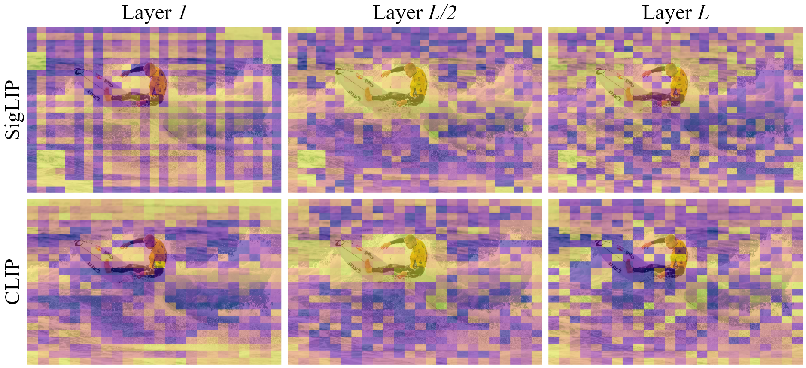
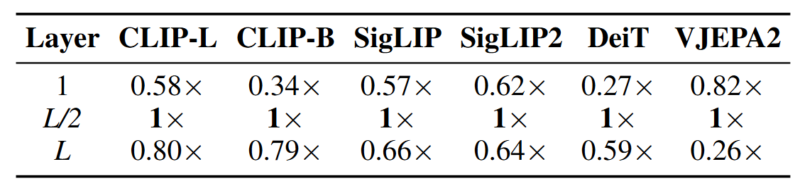
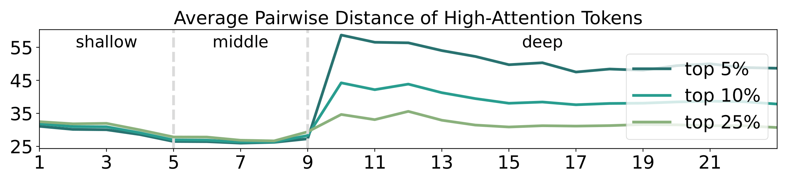
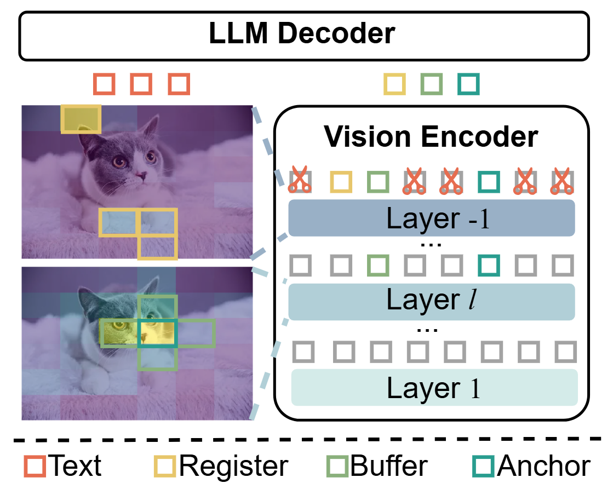

# HiPrune: Training-Free Visual Token Pruning via Hierarchical Attention in Vision-Language Models
[](https://arxiv.org/abs/2508.00553)


## Abstract
Vision-Language Models (VLMs) encode images into lengthy sequences of visual tokens, leading to excessive computational overhead and limited inference efficiency. While prior efforts prune or merge tokens to address this issue, they often rely on special tokens (e.g., CLS) or require task-specific training, hindering scalability across architectures. In this paper, we propose **HiPrune**, a training-free and model-agnostic token **Prun**ing framework that exploits the **Hi**erarchical attention structure within vision encoders. We identify that middle layers attend to object-centric regions, while deep layers capture global contextual features. Based on this observation, HiPrune selects three types of informative tokens: (1) Anchor tokens with high attention in object-centric layers, (2) Buffer tokens adjacent to anchors for spatial continuity, and (3) Register tokens with strong attention in deep layers for global summarization. Our method requires no retraining and integrates seamlessly with any ViT-based VLM. Extensive experiments on LLaVA-1.5, LLaVA-NeXT, and Qwen2.5-VL demonstrate that HiPrune achieves state-of-the-art pruning performance, preserving up to **99.3%** task accuracy with only **33.3%** tokens, and maintaining **99.5%** accuracy with just **11.1%** tokens. Meanwhile, it reduces inference FLOPs and latency by up to **9**$\times$, showcasing strong generalization across models and tasks.

## Highlight
1. We identify that the representation evolves continuously and orderedly, with adjacent layers showing a similar pattern. This indicates a hierarchical attention pattern, where **different phases of layers focus on different levels of image content**.

2. We first plot the rankings of tokens according to their attention score. An obvious rule is that **the middle layers of the encoder consistently focus on the main object**. This is further confirmed by the IoU of the object mask and the top 10% high-attention tokens on the COCO dataset.


3. High-attention tokens in the deep layers show a uniform distribution across the whole image, indicating that **the deep layers focus on tokens with global information**, which is also confirmed by many previous works. 

4. To draw a clear dividing line between different layers, we recognize attention patterns with average pairwise distance between high-attention tokens. Using this dispersion curve, we categorize CLIP layers into three regions: shallow (1–4), middle (5–9), and deep (10+), capturing a transition from noise to object detail and finally to global information.

## Method

To better clarify our method, we first define three types of tokens:
- **Anchor tokens** denote tokens with the highest attention score in the middle layers of the vision encoder. The middle layers tend to focus on the object features, manifested as higher attention scores for tokens related to the object. *Anchor tokens encode rich, detailed information about the raw image.*
- **Buffer tokens** are spatially adjacent to anchor tokens in the original image. As many studies indicate, noise exists in the attention map of ViTs. Despite most high-attention tokens concentrating on the surf-man, a few tokens diffuse among the image, which may mislead the anchor tokens. *Buffer tokens supply detailed information and mitigate the noise issue.*
- **Register tokens** receive top attention scores in the output layer of the vision encoder. In deep layers of the vision encoder, the high-attention tokens distribute uniformly across the image, serving as an ideal indicator of global information. *Register tokens provide critical global information*.

HiPrune retains these three types of tokens and discards the rest before the LLM. Token identification is also an ordered process, from anchor tokens to buffer tokens and finally register tokens, guided by the hierarchical attention from the vision encoder.

## Setup and Install
**Environment Setup.** Since LLaVA and Qwen require different versions of transformers, so please setup the corresponding environment before running them.

- Environment setup for LLaVA-1.5 and LLaVA-NeXT
```bash
bash setup_llava.sh
```

- Environment setup for Qwen-2.5-VL
```bash
bash setup_qwen.sh
```

**Data Access.** Before starting your evaluation, please login with your huggingface token to get access to some datasets.
```bash
huggingface-cli login
```

## Evaluation on LLaVA-1.5
Before starting evaluation on LLaVA-1.5, please follow its [official instruction](https://github.com/haotian-liu/LLaVA/blob/main/docs/Evaluation.md) to prepare data for MMB, MMBCN, textVQA, and VQAv2.

- Accuracy results
```bash
bash bench_llava.sh
```

- Efficiency results
```bash
python bench_sys.py
```

- FLOPs results
```bash
bash flops.py
```

## Evaluation on LLaVA-NeXT
- Accuracy results
```bash
bash bench_llava_next.sh
```


## Evaluation on Qwen2.5-VL
- Accuracy results
```bash
bash bench_qwen.sh
```

## Hyperparameter Setting
If you want to change hyperparameters, you can simply set environment variables in this table.
|Model|Environment Variables|Range|Default|Denote|Description|
|---|---|---|---|---|---|
|LLaVA-1.5|HIPRUNE_RETENTION|1-576|-|$N'$|Token budget|
|   |HIPRUNE_ALPHA|0-1|0.1|$\alpha$|Proportation of anchor and buffer tokens|
|   |HIPRUNE_OBJECT_LAYER|1-24|9|$l$|Object layer to choose anchor and buffer tokens|
|LLaVA-NeXT|HIPRUNE_RETENTION|1-2880|-|$N'$|Token budget|
|   |HIPRUNE_ALPHA|0-1|0.1|$\alpha$|Proportation of anchor and buffer tokens|
|   |HIPRUNE_OBJECT_LAYER|1-24|9|$l$|Object layer to choose anchor and buffer tokens|
|Qwen2.5-VL|HIPRUNE_QWEN_RETENTION|0-1|-|$\frac{N'}{N}$|Token retention ratio|
|   |HIPRUNE_ALPHA|0-1|$\alpha$|0.1|Proportation of anchor and buffer tokens|
|   |HIPRUNE_OBJECT_LAYER|1-24|$l$|16|Object layer to choose anchor and buffer tokens|

## Acknowledgement
This repository is built on [LLaVA](https://github.com/haotian-liu/LLaVA), [FasterVLM](https://github.com/Theia-4869/FasterVLM), [lmms-eval](https://github.com/EvolvingLMMs-Lab/lmms-eval). Acknowledge for their outstanding work!